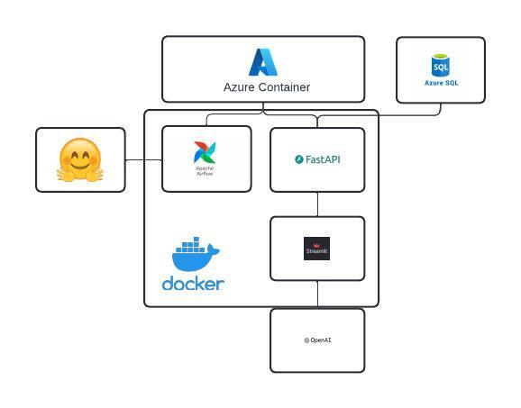

# AI-Driven PDF Pipeline: End-to-End Automation with Airflow, OpenAI-Powered Insights, Full Stack Integration, and Containerized Deployment

## Overview

AI-Driven PDF Pipeline is a comprehensive system designed to automate the process of managing PDF files from Hugging Face and uploading them to Azure Blob Storage, while providing users with an intuitive interface for querying OpenAI about PDF content. The solution integrates an automated pipeline built with Airflow for handling PDF uploads, a Streamlit-based frontend for user registration and interaction, and a FastAPI backend for API responses. The entire project is containerized using Docker Compose, ensuring easy deployment and scalability. With secure user authentication and AI-powered Q&A functionality, AI-Driven PDF Pipeline simplifies document management and enhances content exploration with AI insights.

## Attestation and Contribution Declaration:

WE ATTEST THAT WE HAVEN’T USED ANY OTHER STUDENTS’ WORK IN OUR
ASSIGNMENT AND ABIDE BY THE POLICIES LISTED IN THE STUDENT HANDBOOK
Contribution:
a. Chiu Meng Che: 33%
b. Shraddha Bhandarkar: 33%
c. Kefan Zhang: 33%

## WorkFlow Diagrams



## Codelabs

[Click it to view it](https://codelabs-preview.appspot.com/?file_id=1gBQts95I9VOnikyCroLEi9CNN_CU3dvoj7Q-2rhd6xU#5) 

## Video 

[Click it to watch it](https://youtu.be/pWp70t16a5o)

## Link to streamlit public cloud

[Click it to access streamlit public cloud](https://apptestpy-epkxt8shywfvpwpe4hum3f.streamlit.app/) 

## Key Features

- **Automated Hugging Face PDF Uploads**:
  Utilize Apache Airflow to automate the process of retrieving PDF files from Hugging Face and uploading them to an Azure Blob Storage container.
  
- **Interactive Q&A Interface**:
  A frontend built with Streamlit allows users to ask OpenAI questions about the content of various PDF files and receive dynamic responses.

- **User Authentication & Management**:
  Streamlit provides a user-friendly login and registration system, storing user credentials securely in an Azure SQL Server database.

- **Backend API with FastAPI**:
  The backend, built using FastAPI, serves as the API for handling frontend requests, interacting with the Azure container, and managing user queries.

- **Python Project Management with Poetry**:
  All Python dependencies and virtual environments are managed using Poetry, ensuring consistent environments across development and production.

- **Containerized Services**:
  Docker Compose is used to containerize the entire project, including the Airflow pipeline, Streamlit frontend, and FastAPI backend, ensuring easy setup and scaling.

## Project Structure

```bash
│  .dockerignore
│  .env
│  .gitignore
│  docker-compose.yml
│  project_tree_structure
│  README
│  
├─airflow
│  │  .gitattributes
│  │  airflow.cfg
│  │  Dockerfile
│  │  poetry.lock
│  │  pyproject.toml
│  │  
│  ├─dags
│  │  │  huggingface_pdf_airflow_dag.py
│  │  │  
│  │  └─modules
│  │     │  pipeline.py
│  │     └─ __init__.py
├─backend
│  │  Dockerfile
│  │  fastapi_code.py
│  │  openai_client.py
│  │  poetry.lock
│  │  pyproject.toml
│  └─ __init__.py
│
├─frontend
│      Dockerfile
│      poetry.lock
│      pyproject.toml
│      streamlit_test.py
│
└─images
        workflow_diagram.jpeg
```

## Prerequisites

**Docker**: Required to containerize and run the application services.
- [Download and Install Docker](https://www.docker.com/get-started)
   
**Docker Compose**: For orchestrating the multi-container setup (usually bundled with Docker).
- Verify installation: 
  ```bash
  docker-compose --version
  ```

**Poetry**: A dependency manager for Python to handle virtual environments and package management.
- Install Poetry by following the instructions here: [Poetry Installation Guide](https://python-poetry.org/docs/#installation)
- Verify installation: 
  ```bash
  poetry --version
   ```

**Python 3.10+**: The project uses Python 3.10, ensure it is installed on your machine.
- Verify installation: 
  ```bash
  python3 --version
  ```

Make sure all prerequisites are installed and functioning properly before proceeding with the setup.

## Contributions and Time

Chiu Meng Che:
1. Create a workflow graph to clarify the relationships between Airflow, FastAPI, Streamlit, Azure Blob Storage, Azure SQL Server, and OpenAI.
2. Use Airflow to build an automated pipeline that downloads PDF files from Hugging Face, extracts their content, and stores the results in Azure Blob Storage.
3. Create Dockerfiles for the Airflow container, frontend container, and backend container, and then use docker-compose to run these services simultaneously, setting up a network to ensure  they function properly.
4. Understand the principles of FastAPI and add Azure SQL Server to store credentials.
5. Create a README file.

Shraddha Bhandarkar:

Kefan Zhang: